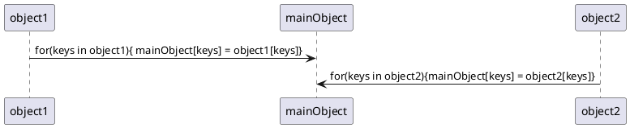

# css

#### %百分比的使用

- ``width/height``
  基于父元素。对于一些需要占满的元素，例如nav、footer，直接设置``width:100%``，当父元素也没有设置具体高度时，此时子元素就算设置了百分比高度仍会变成auto。故在使用百分比时，同一个选择器控制的元素样式可能会不同，因为他们的父元素宽高不同。对于父元素也设置百分比的元素，依然是按照父元素的百分比计算，即和爷爷也有百分比关系

  ```css
  .grandpa {
      width:100px;
  }
  .father {
      with:50%;//100 * 0.5 = 50px
  }
  .son{
      width:50%;//50px * 0.5 = 25px 
  }
  ```

- ``left/right/top/bottom``
  基于父元素。对于一些左右布局，可以使用 ``position：left:50%`` 加 ``margin-left`` 偏移
- ``transform: translateX(-50%)``
  transform表示移动，translate(x,y) 表示X，Y轴移动距离，translateX，translateY分别表示X，Y轴移动距离，百分比基于自身宽高

  ```less
    // 实现水平垂直居中
    position: absolute;
    top: 50%;
    left: 50%;
    transform: translate(-50%, -50%);
  ```

- ``margin/padding``
  ``left/right/top/right`` 都是基于父元素宽度，和**父元素高度**没有关系

  ```less
  .father {
    width: 200px;
    height: 100px;
    border: 1px solid #000;
  }
  .son {
    width: 80%;
    height: 80%;
    margin: 10% 10%;//20px 20px 20px 20px
    background-color: #ff0000;
  }
  ```

- ``border-radius``
  基于自身宽高，设置 ``border-radius:50%`` 可以画出圆
- ``background-position:@prams @prams``
  表示背景图片基于容器的水平垂直位置，不设置时，图片位于元素左上角，参数可使用center/left等，也可以使用百分比，百分比表示：（容器的宽高—背景图片的宽高）*百分比，故50%时，元素居中

  ```less
  // 参数二默认为center，二者等价，都表示水平垂直居中
  background-position:50%;
  background-position:center;
  ```

- ``line-height``
基于自身``font-size``大小
- ``vertical-align``
  对行内元素 inline 和 table-cell 起效（img、span、input、td、button、strong、em），行内元素于一行中的对齐方式：基线对齐，各行内元素的基线皆不同，其中x字母、图片、设置overflow:hidden的行内元素基线在最底部。
  vertical-align决定当前元素在基线的基础上，相对父元素字体垂直移动距离，正值上移，负值下移。还有一些可选值，top表示与元素最高点对齐，text-top表示与父元素字体的顶端对齐

  ```less
  vertical-align: 50%;// 相对于基线上移15px
  line-height: 30px; 
  ```

#### 图片元素的间隙

往div中放入图片，图片底部距离div下方会有一个间隙，两个图片水平之间也会有间隙

- 垂直方向
  行内元素基线对齐后还要和父元素的字体基线保持一致，故图片基线由基于元素底部变成基于x字母，去掉空隙需操作父元素的字体，或者把图片设置成块级元素，或者设``vertical-align``属性

  ```less
  float: left; /* 设置图片浮动属性，默认变成块级元素 *
  vertical-align: top;/* 设置图片垂直对齐方式 */
  font-size: 0; /* 设置父元素文本大小为0 */
  display: block; /* 设置图片为块级元素 */
  line-height: 0; /* 设置父元素行高为0 */
  ```

- 水平方向
空格和换行字符被浏览器解析为空格，可以将图片元素不留空格连写、可以设置块级、浮动

#### 鼠标事件

- ``cursor``
鼠标指针放入元素范围内时显示的形状，常见：``cursor:pointer``
- ``pointer-events``
  设置元素是否鼠标可点击，被设置 ``pointer-events: none`` 的元素不仅无法被点击，而且没有鼠标样式，且其子元素也无法被点击，若子元素需被点击，独自设置 ``pointer-events: initial`` ，即属性初始化，默认可以被点击

#### 文字设置

- ``white-space``
  文字空格。多个空格默认为一个，显示全部空格常用的取值为：``white-space:pre`` 和 pre-wrap，其中 pre 不允许自动换行，原原本本地显示文本，可能超出容器，而 pre-wrap 会根据容器宽度自动换行。二者都保留行尾空格，但pre-wrap 行尾空格也不自动换行，即超过容器，不影响下一行

  ```less
  .pre-article {
    font-family: inherit;
    word-break: break-all;//任意字符换行
    white-space: pre-wrap;//处理空格，是否换行
    }
  ```

- ``word-break``
  文字断行，对于英文单词不进行断行，break-all 表示全部字母断行
- 超出n行后显示省略
  - 一行：设置文字不换行、超出隐藏、超出使用省略号展示

  ```less
  white-space:nowrap;
  overflow:hidden;
  text-overflow:ellipsis;
  ```

  - n行：超出隐藏、超出使用省略号展示

  ```less
  display:-webkit-box;
  -webkit-box-orient:vertical;
  -webkit-line-clamp:n;
  overflow:hidden;
  text-overflow:ellipsis;
  ```

- 文本左右两端对齐

  ```less
  p{
      text-align:justify;
      text-justify:distribute
  }
  ```

#### rgba和opacity

opacity 属性后代元素都会继承 opacity 属性，而rgba后代元素不会继承不透明属性，故使用rgba代替opacity，取值皆是从 0.0 （完全透明）到 1.0（完全不透明）

```less
// 设置分页器样式
    &-paginat {
        display: flex;
        width: 100%;
        position: absolute;
        bottom: 84px;
        justify-content: center;

        .swiper-pagination-bullet {
            width: 21px;
            height: 21px;
            margin-right: 9px;
            border: 2px solid #FFF;
            border-radius: 50%;
            background: rgba(0, 0, 0, 0);

            &-active {
                background: #6B91CE;
            }

            &:last-child {
                margin-right: 0;
            }
        }
    }
```

#### 图片相关

图片可以作为背景（background-img）插入元素，可以通过 img 标签作为行内元素插入 dom

```less
// 使用background设置图片背景
// 1，联用，不规定顺序，但是同一个属性不能分开，（位置left和top不能分开 background:10px #ccc 10px 报错）
background: url('') repeat #fff fixed center// 图片 重复 颜色 是否固定 位置
// 2，单用
background-image:url('')
```

- 设置背景和容器契合
  直接使用img(width:100%)，图片不一定完全覆盖容器，即高度不够；在div中使用background，全覆盖和原比例都可以做到
  - background-size
    - cover
     将图片按照原有比例放大至填满容器，设置 width:100% 或 height：100%，超过部分不可见，图片不变形
    - 100%
     图片在x轴方向缩放至填满容器，y轴不管，图片不变形
    - 100% 100%
     图片宽度长度都按容器比例撑满，图片变形

     ```less
     background-repeat: no-repeat;
     background-size: cover;
     background-size: 100%;
     background-size: 100% 100%;
     ```

  - img

    ```less
    display:block
    width:100% // 根据父元素宽度缩放
    ```

#### display:flex

弹性布局，设置子元素布局方式，当弹性盒子设置不换行时，子元素本身设置的宽度可能会变，若元素都能正常缩放，子元素自动缩放到能全部放下盒子，且按照宽度**等比**缩放，即宽度1：2：3，最后宽度也是1：2：3，但是元素最小宽度为**子元素最大宽度**，弹性布局也不能缩小到其以下，故比例也会变，先按照比例缩小，到有元素不能缩小后，缩小能缩小的元素，最后所有盒子缩小完毕，若仍不能放下，则超出（若纯文本盒子，最后缩小到一个字一行），弹性盒子拥有六大属性，子元素也有六大属性
**弹性盒子**

- flex-direction：决定子元素排列主轴与顺序，取值：row/column-reverse
- flex-wrap:决定子元素是否换行显示与换行方向（从顶端排到下or底部排到上），取值：nowrap/wrap-reverse
- flex-flow：不常用，简写上面两个属性，默认为：flex-flow:row nowrap
- justify-content：主轴上的对齐方式，flex-satrt/end，center，space-between，space-around（每个项目两侧的间隔相等，项目之间的间隔比项目与边框的间隔大一倍）
- align-items：项目在交叉轴上的对齐方式，除了左右中对齐外，还有基线对齐（baseline），stretch（项目未设置高度或设为auto，占满整个容器的高）
- align-content：多轴线的对齐方式，和justify-content差不多
**子元素**
- order：排列顺序
- flex-grow：放大比例，默认为0
- flex-shrink：缩小比例，默认为1
- flex-basis：在主轴占的空间，默认为原本项目大小
- flex：综合前面三个属性，默认为 0 1 auto，该属性有两个快捷值：auto (1 1 auto) 和 none (0 0 auto)
- align-self：不遵从父元素的对齐（align-item），自定义对齐方式
**弹性盒子缺点**
- flex盒子的内容可以溢出，即内容宽度可能超过父元素宽度（有些内容溢出不涉及宽度变化：比如 { width: 10px; white-space: nowrap;} ）
- 若子元素写了 { overflow: hidden; }，则宽度不会溢出，文字内容也可以点点点。但会影响一些绝对定位等位置需要超出该元素的内容。
**检查弹性盒子是否溢出**
justify-content: center，若盒子移位了，表示溢出

#### position

设置元素位置，默认为static，即静止不移动，当position设置为relative/absolute/fixed时，通过top/left/right/bottom可改变元素位置，其中absolute/fixed是脱离文档流的，但relative是不会脱离文档流，即relative会占据着移动之前的位置，但是absolute和fixed就不会）

#### min-width、width和max-width

优先级：min-width = max-width > width
当 max-width > width > min-width 时，宽度的标准是 width，否则取最大/小宽度，min-width、max-width设置百分比时，都会继承父元素的当前显示宽度

#### position和margin冲突

绝对定位是根据相对于父元素的top/left/right/bottom来定位的，而margin是根据自身当前位置来定位的，故设置margin失效
1，元素在绝对定位以后，left/rigth/top/bottom是没有优先等级的，不像margin-left作用的时候margin-right没用，如果现在left:0,right:0,两方实力相当，浏览器没办法，都得满足

```less
    position:absolute
    left:0
    right:0
    margin:0 auto
```

2，当它距离父元素left:50%,top:50%，那就是父元素一半的距离，因为要实现居中即自身的中点在父元素的中间才算，所以margin-left/margin-top 负的自身宽/高的一半，那么正好水平垂直居中，但是由于margin相对于父元素，故不得使用百分比。

```less
    position:absolute
    left:50%
    right:50%
    margin-left:-50px;// 具体数值
    margin-top:-50px;
```

#### 垂直水平居中

- 水平居中，直接设置margin

  ```less
  margin:0 auto
  ```

- 垂直居中
  - position结合margin

    ```less
    {
        position:relative;
        top:50%;
        margin-top:-50px;
    }
    ```

  - transform 结合 position

    ```less
    {
        position:relative;
        transform:translateX(-50%)
    }
    ```

  - 弹性盒子

     ```less
     {
         display:flex;
         align-items:center;
         justify-content:center;
     }
     ```

  - 表格元素：显示设置父元素为：table，子元素为：cell-table，这样就可以使用vertical-align: center，实现垂直居中

     ```less
     .parent{
         display:table
     }
     .son{
         display:table-cell;
         vertical-align:middle;
         text-align:center
     }
     ```

#### css样式初始化

初始化可以解决浏览器的兼容问题，因为不同浏览器对有些标签的默认值是不同的

- 通配符初始化，简单粗暴，但初始化所有标签，浪费性能

  ```less
  *{
      paddind:0;
      margin:0
  }
  ```

#### 伪元素和伪类

伪类通过添加类来实现；伪元素通过添加实际的元素来实现，伪元素创建了一个不在文档树上但实际存在的新的元素，所以不能通过js来操作，仅仅是在 CSS 渲染层加入，要配合content属性一起使用

- 伪元素失效
  在input、radio、select等表单标签中，伪元素失效，::before的定义：在指定元素的内容之前插入内容。注意：是元素内容之前，而不是元素之前。而input并不是容器，所以没有内容之前一说，所以就无效了。
- 伪元素使用，必须设置content ，其余和正常项目一致，常使用position改变伪元素位置

  ```less
  &::before{
      content:'';
      position: absolute;
      top: 37px;
      left: -15px;
  }
  ```

#### 盒子两端对齐

即元素每一行两端对齐，但是最后一行靠左，类似于文字的justify两端对齐，最佳实现效果是根据容器的宽度排列，决定元素之间的间隙与单行个数

- 使用margin-right搭配float，改变宽度时无法兼容

  ```less
  {
      margin-right:20px;
      float:left;
      &:nth-child(3+3n){
          margin-right:0;
      }
  }
  ```

- 弹性盒子添加空元素，宽度与项目保持一致，高度设为0

  ```less
  {
      display:flex;
      justify-content:space-between;
      flex-wrap:wrap;
  }
  .item-empty {
        height: 0px;
        width: 400px;

 }

  ```

- 当一列只有2/3个时，使用伪元素

  ```less
    &::after {
                height: 0;
                width: 20%;
                min-width: 223px;
                content: "";
            }
  ```

# js

#### 深拷贝和浅拷贝

- json化实现
  先使用JSON.stringify将对象变成json字符串，再使用JSON.parse将字符串转为新对象，缺点是遇到无法转换为json格式的属性时，例如function、RegExp、undefined等数据，转化直接忽略，即深拷贝的数据会丢失，可以使用JSON.stringify()对特殊类型进行格式化

  ```js
  let _obj = JSON.stringify(obj)
  let obj = JSON.parse(_obj)
  ```

- Object.assign
- 递归实现
  判断参数类型，判断参数属性类型，若参数属性为对象则递归调用，参数为非引用值则直接赋值

  ```js
  function deepClone(obj){
      let result
      if(typeof obj == 'Object'){
          result = Array.isArray(obj) ? [] : {}
          for(let key in obj){
              if(typeof obj[key] !== 'Object'){
                  result[key] = obj[key]
              }else{
                 result[key] =  deepClone(obj[key])
              }

          }
      }else{
          result = obj
      }
      return result
  }
  ```  

#### Object.assign(mainObject,...)

  参数一是目标对象，接收后面参数对象**可枚举**的属性（一般对象的属性都是可枚举的，除非对象的enumerable属性为false），目标对象有该属性则覆盖，无则添加，有一些拷贝的性质，但若参数的属性值为对象，则单凭赋值还是指向同一个地址，实现的是只有一层的拷贝，见[图 1](#img1)<span id="jumpImg1">*</span>

#### 检测数据类型与toString()

- typeof --- typeof xxx
  判断数据类型，对于非引用类型可显示（string、boolean、number），对于数组、对象、实例、null都识别为object，对于undefined识别为undefined，对于函数识别为function
- instanceof --- xxx instanceof Object
  返回一个boolean值，查看对象B prototype指向的原型对象是否在对象A的prototype原型链上，若对象B的prototype为null将会报错，类似于空指针异常，不可以检测非引用类型，因为没有原型对象，对象A必须是对象
- constructor
  对象的constructor指向创建该对象的构造函数，但是不常用这个判断对象类型，因为contructor的指向是可以通过赋值操作被改变的，其中null、undefined没有construtor，其余可以被检测出来
- Object.prototype.toString.call(obj)
  返回一个形如'[Object type]'的字符串，例如'[Object String]'，Array、String中的toString方法是被修改过的，故不能直接使用toStirng检测，而要使用Object对象原型的toString检测
  
#### Object的内部方法

- Object.defineProperty(obj，property，descriptor)
  操作对象的属性，有则修改，无则添加，参数三为一个对象，控制**属性描述符**对象，属性描述符对象有六个属性，不止控制属性的value（属性值），还有writable（是否可改），enumerable（是否可枚举）等，通过defineProperty定义的属性，与普通定义的属性不同，因为它是默认不可枚举、不可修改的、不可删除的。

  ```js
  Object.defineProperty(obj,'name',{
      value:'',
      writable:true,// 是否可修改
      enumerable:true,// 是否可枚举
      configurable:true// 是否可修改
  })
  Object.defineProperty(obj,'name',{})// 定义并传空，默认描述符如下
  obj.descriptor === {
      value:undefined,// 默认未定义
      writable:false,// 不可修改
      enumerable:false,// 不可枚举
      configurable:false// 不可修改
      set:undefined,// 默认未定义
      get:undefined,// 默认未定义
  }
  ```

- Object.defineProperties(obj, properties)
  批量操作对象的属性，参数二对象每一个属性都操作一个对象属性，属性名为对象属性名，属性值为对象的属性描述符

  ```js
  Object.defineProperties(obj,{
      'name':{
          vaule:,
          writable:
      },
      'age':{
          vaule:,
          writable:
      }
  })
  ```

- Object.getOwnPropertyDescriptor(obj,property)
  获取对象对于属性的属性描述符对象，返回一个对象

  ```js
  let descriptor = Object.getOwnPropertyDescriptor(obj,'name')
  descriptor// 包含六个属性的name属性描述符对象
  ```

- Object.getOwnPropertyDescriptors(obj)
  获取对象所有属性的属性描述符对象，返回一个对象，每一个属性都表示一个对象属性的描述符对象

  ```js
  let descriptors = Object.getOwnPropertyDescriptors(obj)
  descriptors === {
      'name':{
          // 包含六个属性的name属性描述符对象
      },
      'age':{
          // 包含六个属性的name属性描述符对象
      }
      }
  ```

- Object.getPrototypeOf(obj)
  返回对象的原型对象，若没有继承的原型对象，则返回null，见[图 2](#img2)<span id="jumpImg2">*</span>

- Object.setPrototypeOf(obj1,obj2)
  设置一个对象的原型对象，等价于obj1.__proto__ = obj2
- Object.create(obj)
  其中参数1表示被创建出来新对象的原型对象,等价于obj1.__proto__ = obj2

- Object.preventExtensios(obj)
  让一个对象变成不可扩展的，即不能再添加新属性，es5若仍要添加新属性，会抛出错误，es6后不改变属性不报错，但若是使用definePrototype定义属性的话，还是会报错。此外，Object.isExtensible()用于检查对象是否可扩展，传入一个对象返回boolean值，若传入一个非对象的变量，es5抛出错误，es6则将变量强制转为对象并返回false
- Object.keys(obj)
  返回可枚举属性组成的数组

#### reflect对象

   ES6提供的一个将常见js对象内部方法（Object.xxx(obj) or Object.prototype.xxx(obj)）封装并反射出来的对象（reflect.xxx(obj)），原因是：1，内部的方法不希望被暴露；2，reflect返回值更合理，使用defineProperty方法Object报错而reflect只是返回false；3，Object存在命令式，例如：delete obj.name，不符合面向对象的思想，reflect是对象，纯函数式调用方法，变成 reflect.deleteProperty(obj,name)。reflect对象拥有13个方法，且对第一个参数严格控制，若不传对象/函数，报错。

- get(obj,attribute,receiver)
  get和set的最后一个参数都是用来绑定this的，当属性部署了读取函数(get name(){})/赋值函数(set name(){})时起作用
- set(obj,attribute,value,receiver)
- has(obj,attribute)
  返回一个boolean值，和 attribute in obj效果相同
- deleteProperty(obj,attribute)
- construct(obj,args)
  等同于new，reflect.construct(Fun,'lyf') 等价于 new Fun('lyf')，但是参数一必须是函数，不常用
- apply(fun,receiver,args)
  参数一是函数，参数二表示绑定的this，参数三表示传入函数的实参，与fun.apply一致，实参传入一个数组
- getPrototypeOf(obj)
  获取对象的原型对象，返回boolean值
- setPrototypeof(obj,newProto)
  设置对象的原型对象，返回一个boolean值
- defineProperty(obj,attribute,descriptor)
  设置对象的标识属性
- getOwnPropertyDescriptor(obj,)
- isExtensible(obj)
- preventExtensions(obj)
- ownKeys(obj)
  返回一个包含所有属性名的数组

#### reflect和Object的对比

|  reflect   | Object  | 功能 |
|  ----  | ----  | ---- |
| reflect.has(attribute)  | attribute in obj | 检车属性是否在对象中 |
| reflect.set(obj,attribute,value,receiver)  | obj[attribute] = value | 设置对象属性，常用后者 |
| reflect.get(obj,attribute,reciver) | obj[attribute] | 获取对象属性，常用后者 |
| reflect.deleteProperty(obj,attribute) | delete obj[attribute]  | 删除对象的属性,使用前者* |
| reflect.ownKeys(obj) | Object.keys(obj) | 皆返回一个属性组成的数组，前者返回所有属性，后者只返回可枚举属性 |
| reflect.defineProperty(obj,attribute,descriptor) | Object.defineProperty(obj,attribute,descriptor) | 全面地**描述**属性，前者返回Boolean值，后者返回设置好的对象 |
| reflect.getOwnPropertyDescriptor(obj,attribute) | Object.getOwnPropertyDescriptor(obj,attribute) | 返回对象某属性的属性属性描述符对象，二者几乎一致，无该属性则返回undefined |
| reflect.getPrototyOf(obj) | Object.getPrototyOf(obj) | 返回原型对象，如无返回null，二者几乎一致 |
| reflect.setPrototyOf(obj,prototype) | Object.setPrototyOf(obj,prototype) | 设置对象的原型对象，前者返回Boolean值，后者返回新对象 |
| reflect.isExtensible(obj) | Object.isExtensible(obj) | 检查对象是否可扩展，二者几乎一致 |
| reflect.preventExtensions(obj) | Object.preventExtensions(obj) | 将对象设置为不可扩展的，前者返回Boolean值，后者返回设置好的对象 |
| reflect.apply(fun,receiver,args) | Function.prototype.apply(receivers,args) | 二者功能几乎一致，常使用后者 |
| reflect.construct(Fun,args) | new Fun(args) | 构造函数实例，常使用后者 |

#### js中的事件

在页面中，一些用户触发的行为，浏览器对象BOM触发的行为，可以称为事件，js捕获事件并触发对应的回调函数，称为js事件

- 事件流
  过程是根节点到目标节点，再从目标节点到根节点，例如一个div触发点击事件，流程为：document->html->body->div(click)->body->html->document，前面为捕获事件，后面为冒泡事件
  [点击跳转](#img3) <span id='jumpImg3'>回来</span>
- 监听事件
  1，html属性
  属性名为 on+event，绑定的事件需**调用**，类似于事件触发时，调用一个早已准备好的函数

  ```js
  <div onclick="clickHandle()"></div>
  ```

  2，dom属性
  在dom中获取元素并在事件属性中绑定函数，需确保dom中有此元素，故在window.onload中执行，属性值一般是唯一的，所以只能绑定一个函数

  ```js
  window.onload = function(){
  document.getElementById('div1').onclick = clickHandle// 需注意在window.onload中，document才能获取到页面节点
  }
  ```

  3，标准dom
  在dom中获取元素并在事件属性中绑定函数，需确保dom中有此元素，故在window.onload中执行，可以绑定多个事件函数，顺序是先绑定先执行
  element.addEventListener(event,callback,isCapture)
  参数1 event 事件名的字符串，只能绑定确切存在事件，例如click，不能自创事件，啥'show'
  参数2 callback 事件触发时绑定的回调函数，内有一个参数，代表触发事件的元素
  参数3 isCapture 表示事件是在捕获还是冒泡环节触发，boolean值，默认为false，即不再捕获阶段触发，而是冒泡

  ```js
  window.onload = function(){
  document.getElementById('div1').addEventListener('click',(e)=>{console.log(e)},true)
  }
  ```

- 移除事件
  只有使用标准dom绑定的事件函数可以移除，且必须移除同一个回调函数(地址)
  element.removeEventListener(event,callback,isCapture)
  参数1 event 必选，表示需移除的事件
  参数2 callback 必选，表示事件
  参数3 表示要移除的事件的触发阶段，即addEventListener的参数3

  ```js
  element.addEventListener('click',function(){1},false)// 函数在内部,其他地方无法获取
  element.addEventListener('click',function(){2},false)
  element.addEventListener('click',function(){3},false)
  element.addEventListener('click',function(){4},false)

  elsment.removeEventListener('click',function{1})// 不会移除,因为这只是长的一样的函数
  ```

# Vue

#### Vue事件

通过 Vue 发送的事件，而不是 dom 事件，一般使用 emit 发送，on 接收，off 去除，和标准 dom 事件监听 addEventListener、removeEventListener 相对应

- vue.$emit(event,attrbutes)
  参数1 event 为表示事件的字符串，类似于dom事件的'click'、'mousedown'，但是这个没有固定的限制
  参数2 attributes 表示传给监听事件回调函数的参数
  本质上是给本组件监听，可以在本组件使用 vue.$on 和 vue.$once 监听，在父组件则是使用 v-on 监听子组件传出的事件

  ```js
  <son @sonEvent="handle"></son>  
  ```

- vue.$on()

### 自定义指令

可以全局和局部自定义指令，使用 directive 注册一个指令，并设置其钩子函数，全局则是调用Vue原型方法 Vue.directive('orderName',{pFunction1,pFunction2})，局部则是属性对象 directives:{orderName1:{pFunction1,pFunction2},orderName2:{pFunction1,pFunction2}}，在 dom 元素中使用 v-orderName 即可，也可绑定属性

#### 自定义指令的钩子函数(pFunction) 五个

- bind
  绑定时调用，只调用一次，类似于 created 周期函数，此时元素还没有渲染
- inserted
  插入时调用
- update
  更新时调用，此时 dom 更新前
- componentUpdate
  在 dom 更新完毕后调用
- unbind
  解绑时调用，例如元素销毁

#### 钩子函数的参数

使用这些钩子函数时，固定有几个参数

- el
  表示绑定指令的元素，可以直接操作修改元素
- binding
  一个**对象**，包含一些具体的属性
  - name
    为指令名称，不含 v-
  - value
    为指令绑定的值，v-xxx="name"，自定义指令没有:绑定符号，故需要此属性找寻 data 中的 name 属性或 name 函数，无则警告
  - expression
    为指令绑定的字符串，以上直接返回 'name'
  - arg
    为指令传入的参数，使用 ':' 符号绑定，例如 v-xxx:name，即传给指令一个参数 'name'
  - modifiers
    一个对象，使用 '.' 绑定，不限个数，例如 v-xxx.a.b，显示 {a:true, b:true}
- vnode
- oldValue

# ES6

#### class类

定义一个类，直接 class className{constructor(attributes){}}，实例化一个类，直接 new className(attributes)

- 静态static
  没有被修饰符修饰的属性直接在实例上，static修饰的属性不会被实例继承，只能被类调用

  ```js
  class FullName{
      static name = "lyf";
      anthorName = "anthor";
      constructor(firstName,lastName){
          this.firstName = firstName
          this.lastName = lastName
      }
      static sortFullName(){
          return this.firstName + this.lastName
      }
      reserveFullName(){
          return this.lastName + this.firstName
      }
  }
  let fullName = new FullName('l','yf')
  // fullName 的结构
  {
      // 不包括静态属性和方法
      anthorName:'anthor',// 类的公有属性
      firstName: 'l', // 传入的实例属性
      lastName: 'yf', // 传入的实例属性
      Prototype:{ // 原型上挂载类的公有方法和 constructor
          constructor: class FullName,
          reserveFullName: ƒ reserveFullName(),
          Prototype:Object// 原型的原型才是Object的原型对象
      }
    }

  ```

- 私有属性
  ES6没有私有属性的概念，使用形如'#attribute'，即在属性前加#符号，表达私有属性。虽然只有在类内部才能读取该属性，但其在实例中仍可以打印显示，只是#开头的属性违法，无法通过 class.#attribute 访问。这只是一种巧妙，使用其他符号定义属性也是一样的，只是约定是#，其他符号都犯法。此外，js命名规则是只能使用字母、$符号、下划线开头

  ```js
  class Foo {
    #a;// 私有属性
    #b;// 私有属性
    #sum() { return this.#a + this.#b; }// 私有属性表示私有方法，故在第一层
    printSum() { console.log(this.#sum()); }
    constructor(a, b) { this.#a = +a; this.#b = +b; }
  }
  let foo = new Foo(12,2)
  foo  === {
      #a : 12,// 无法访问
      #b : 2,// 无法访问
      #sum : f;// 无法访问，虽是方法，但在第一层
      prototype:{
          constructor : f;// 只能通过自身属性（包括原型上的）去修改、展示内部私有属性
          printSum : f// 只能通过自身属性（包括原型上的）去修改、展示内部私有属性
      }
  }
  
  ```

- 继承
  通过 ES6 的关键字 extends 继承，若没有设置其他则相当于继承了父类的所有属性和方法。若在子类中自定义 constructor 设置 this 实例属性，必须使用 super 关键字继承父类的构造函数，因为 ES6 是先在解析父类的属性，再用子类的构造函数覆盖，super 就是使其先继承父类的构造函数，不设置则报错，且必须设置在最前面，不然也是跨父类了。super 作为函数调用只能在构造函数中，作为对象调用不受限，super 作为对象时在**普通方法**中指向父类的原型对象，即父类的静态方法；在**静态方法**中指向父类，即父类的普通方法。

  ```js
  class Farther{
      constructor(x,y){
          this.x = x;
          this.y = y
      }
  }
  class Son extends Farther{}// 没有构造函数，可以不使用super
  class Son extends Farther{
      constructor(x,y){
          // 有构造函数，必须使用super
          this.x = 111 // 报错，因为没有经过父类
          super(x) // 将传入实例的参数赋值给父类，this.x = x
          this.x = 1111 // 在此之前 this.x = x，在此之后 x == 1111
      }
  }
  ```

## HTTP请求

超文本传输协议，基于 tcp，有 0.9、1、1.1、2 等版本，常见发送 HTTP 请求的方式有 AJAX 和 axios

### AJAX请求

创建一个ajax请求一般分为五步。

- 1、创建对象

  ```js
  let xhr = new XMLHttpRequest()
  ```

- 2、使用 open 设置请求

  ```js
  xhr.open('method','url',isAsycn)
  /*
  * @params GET or POST
  * @params  请求地址
  * @params 是否异步，默认为true，即 send 后不必等到其执行完毕
  */
  ```

- 3、使用 send 发送请求

  ```js
  xhr.send(requestData)
  /*
  * @params 请求时传的参数，因为默认传的内容为文本格式，故需要设置请求头，可传字符串和对象
  * /
  ```

- 4、监听状态变化，一旦状态变化调用函数

  ```js
  xhr.onreadystatechange = function(){

  }
  ```

- 5、根据返回的请求状态表示请求成功

  ```js
    xhr.onreadystatechange = function(){
        if(xhr.readyState == 4 && xhr.status == 200){
            // 请求成功后的操作，一般操作 responseText
        }
    } 
  ```

- 6、其余设置

解决传参不便的问题，需设置请求头

```js
xhr.RequestHeader('Content-Type','application/x-www-form-urlencoded;charset=UTF-8')
```

### axios

axios 是一个外部库，使用前需安装或引入。常用的 axios 方法参数都是不定的，可以只传一个 url 字符串，将参数拼至 url 后。也可以传多个参数，常见的方法有：axios()、axios.request()、axios.post()、axios.get()、axios.all()、axios.create()

```js
// 安装或引入 axios
npm install axios
import axios from 'axios';

<script src="https://unpkg.com/axios/dist/axios.min.js"></script>
```

#### 请求配置项

当直接使用 axios(paramObj) 时，传入一个定义关于请求的对象。

- transformRequest、transformResponse 的格式是 数组嵌套函数，其中函数的参数就是请求参数，需返回一个值，表示操作后的请求参数:[function(data){return data}]。
- params 和 data 的区别：params 拼接在 url 后，但是 data 作为一个请求体被发送。get 请求没有 data 属性，该属性仅存在 put/post/patch 中

```js
{
    url:'',
    method:''
    baseURL:'',
    // 在请求发送之前，对数据进行改动。例如：将 undefined、null 转为空，或者将 Array -> &字符串
    transformRequest:[function(data){
    // 此处根据需求改变数据
    return data;
    }],
    // 在请求响应到达`then/catch`之前，对数据进行改动
    transformResponse:[function(data){
    // 此处根据需求改变数据
    return data;
    }],
    // 操作自定义请求头信息
    headers: {'X-Requested-With':'XMLHttpRequest'},
    // 让参数（params）序列化
    paramsSerializer: function(params){
    return Qs.stringify(params,{arrayFormat:'brackets'})
    },
    // 请求参数，类型为一个纯对象，或 URLSearchParams 对象
    params: {
    ID:
    },
    data {
    firstName:
    },
    // 表示请求发出的延迟毫秒数，如果请求花费的时间超过延迟的时间，那么请求会被终止
    timeout:1000,
    // 表明是否是跨域请求，默认为 false，表示不是跨域请求
    withCredentials:false,
    // 表示返回数据的格式，可选值为：arraybuffer、blob、document、json、text、stream，默认为json
    responseType:'json',
    // 相应内容的最大值
    maxContentLength:2000,
    // 上传进度事件
    onUploadProgress:function(progressEvent){
    // 下载进度的事件
    onDownloadProgress:function(progressEvent){}
    },
    // 表明 HTTP 基础的认证和证书，这会设置一个 authorization头（header），并覆盖你在 header 设置的 Authorization 头信息
    auth: {
    username:"zhangsan",
    password: "s00sdkf"
    },
    // 适配器选项允许自定义处理请求，这会使得测试变得方便
    // 返回一个promise，并提供验证返回
    adapter: function(config){
    /*..........*/
    },
    // 用作 xsrf token 的值的cookie的名称
    xsrfCookieName: 'XSRF-TOKEN',// default
    xsrfHeaderName:'X-XSRF-TOKEN',// default
    // `validateStatus`定义了是否根据http相应状态码，来resolve或者reject promise
    // 如果`validateStatus`返回true(或者设置为`null`或者`undefined`),那么promise的状态将会是resolved,否则其状态就是rejected
    validateStatus:function(status){
    return status >= 200 && status <300;//default
    },
    // 表示 nodejs 中重定向的最大数量，默认为 5 
    maxRedirects: 5, //default
    // `httpAgent/httpsAgent`定义了当发送http/https请求要用到的自定义代理
    // keeyAlive在选项中没有被默认激活
    httpAgent: new http.Agent({keeyAlive:true}),
    httpsAgent: new https.Agent({keeyAlive:true}),
    // proxy定义了主机名字和端口号，
    // `auth`表明http基本认证应该与proxy代理链接，并提供证书
    // 这将会设置一个`Proxy-Authorization` header,并且会覆盖掉已经存在的`Proxy-Authorization`  header
    proxy: {
    host:'127.0.0.1',
    port: 9000,
    auth: {
        username:'skda',
        password:'radsd'
    }
    },
    // `cancelToken`定义了一个用于取消请求的cancel token
    // 详见cancelation部分
    cancelToken: new cancelToken(function(cancel){})
}
```

#### 常见的请求状态码

|  状态码   | 功能  |
|  ----  | ----  |
| 100 | 继续请求 |
| 200 | 请求成功 |
| 202 | 请求已接收，但未处理 |
| 204 | 请求已处理，但是没有返回任何实体内容，可能只更新了头部信息 |
| 301 | 请求已转移url |
| 404 | 请求失败，资源没有找到或不存在 |
| 500 | 服务器出错，无法完成请求 |
| 503 | 服务器由于过载或维护，无法完成当前请求 |

####

# 零碎

#### Promise调用的区别

Promise是层级调用的，即then在同一层，调用就在一层，vue刷新也只有一次

#### CLS

  全称CommonLanguageSpecification，即公共语言规范

#### markdown语法

- 页面内跳转
  一个带id的html标签，代表要跳转的地方： <span id="jump">跳转到的地方</span>
  当需要跳转时，使用[](#标签id)，例如：[点击跳转](#jump)

#### 热重载

也叫热更新，不需要刷新页面就更新

#### 文档模式

标准模式和混杂模式，一般是对css初始化的不同，例如标准盒子、是否有3px差异

#### JSON的方法

- JSON.stringify(@param1,@param2,@param3)
   参数1：表示需要JSON化的对象，是必须的。
   参数2：函数or数组，用于过滤和自定义，当为过滤函数时，参数为对象的key和值，必须拥有return值，若return对象，则先遍历该对象，类似于栈先进先出，完了再按照顺序遍历，直到所有遍历完退出；若为数组，表示需遍历的属性，不在列表的不被序列化。
   参数3：表示字符串间距，每一级对比上一级缩进

   ```js
   JSON.stringify(data,function(key,val){
       console.log(key)// key和value最外层为 '' 和 object
       console.log(val)
       if(typeof val === 'function'){
           return val + '';
       }
   })
   JSON.stringify(data, ["name", "info", "sex"]);
   ```



<span id="img2">图 2</span> [点击回去](#jumpImg2)

 ```plantuml
@startuml
(window) -> (触发事件的目标):捕获过程
(触发事件的目标) -> (window):冒泡过程
@enduml
```

<span id="img3">图 3</span> [点击回去](#jumpImg3)
