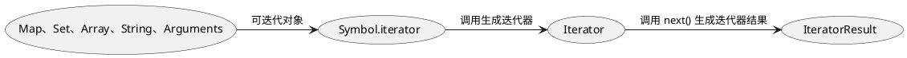

[TOC]

## 二、javaScript

#### js标签的属性

- defer
在外部文件中使用，推迟执行js脚本，虽然立即下载脚本，但是在页面加载完才执行，不影响页面加载，有顺序影响，若多个推迟执行脚本，会按照顺序执行
- async
在外部文件中使用，异步执行脚本，虽然立即下载脚本，但是在页面加载完才执行，不影响页面加载，没有顺序影响，若有多个异步执行，不能确保执行顺序
- type
默认为'text/javascript',当使用export和import时.可能会修改
- src
设置外部文件的源，脚本没有跨域限制
- integrity
因为没有跨域限制，所以为了防止同一个源的js文件被恶意修改，integrity可以设置一个签名，对比js文件返回的签名，若不同则报错

#### 动态加载脚本

即需要时才加载此脚本，但是浏览器预加载器不知道，需要设置'<link rel='pereload' href='index.js'>'
1，创建一个script节点
2，给该节点添加属性
3，将节点加入到dom结构中

```js
let script = document.createElement('script')
script.src = 'index.js'
document.head.appendChild(script)
```

#### js补充

- 行内脚本的缺点
1，不能使用'</script>'字符串，当做脚本结束标签，需要变成'<\/script>'
2，在XTML标签中，将 < (小于号)当做标签
3，多个页面使用同一段代码时，造成资源浪费
4，在head标签中使用脚本，脚本代码没有加载完，页面也不会执行，但是设置了defer/async的外部脚本文件不会影响页面加载
- 外部文件脚本的优点
1，多个页面使用，文件只下载一次
2，没有以上限制
- noscript标签
在不支持脚本的页面才显示，支持脚本的浏览器永远不显示标签的内容

## 三、语言语法

#### 七种数据类型

| Number | String | Boolean | Symbol | Null | undefined | Object |
|  ----  | ----  | ---- | ---- | ---- | --- | --- |
| 原始 | 原始 | 原始 | 原始 | 原始 | 原始| 引用 |
| typeof检查: Number | String | Boolean | Symbol | Object| undefined  | Object |

- typeof缺点
对于Array、Null数据，都会检测为Object，原理：typeof实际上检测的是数据类型指向的地址，其中000表示对象，而null恰好是空指针对象，所以判为对象

| 000->对象 | 1->整数 | 010->浮点数 | 100->字符串 | 110->布尔
|  ----  | ----  | ---- | ---- | ---- |

- 构造函数与对象
使用构造函数和对象创建实例的区别，虽然log打印相同，但是一个是Number型，一个是Object型，二者本质不相同。Number、Boolean、String皆是，但是Symbol没有new构造函数

```js
// Number 
let num = Number(1) // num = 1
typeof num // Number
let num_1 = new Number(1) // num = 1
typeof num // Object
```

##### Number数据类型

支持十进制、十六进制（0x开头）、八进制（0开头，后面数字不大于7）、浮点值。拥有最大值（Number.MAX_VALUE）和最小值（Number.MIN_VALUE），超过则为+-infinity，对于本该是数字但不是数字的表示为NaN，例如：分母为+-0，式子包含NaN等，但是每个NaN都互不相等

```js
NaN == NaN // false
```

- 非数值转为数值的方法
  - Number(param)
  - parseInt(param,scale)
  常用。参数二表示进制，可以选择二、八、十六进制。若不定义，则按照字符串命名显示，即长得像什么（x0、07），就当做什么。自动忽略空字符串，从第一个非空开始检测，若其为非数字，返回NAN（纯空字符串也为NaN），若为数字，截取到非数值字符串之前，并作为结果返回，自然‘.’也当做非数值字符串，遇到也返回。
  - parseFloat(param)
- Null和undefined
Null表示空指针对象，undefined则是声明但未定义，但是null == undefined

##### String数据类型

使用单、双、反引号（模板字面量，可换行，可使用${}插值）包裹的都是字符串，可以解析类似于‘\n’的转义字符，若不想解析，使用String.row(string)

- 非字符串转为字符串
  - xxx.toString()
   但是null和undefined没有此方法，对于数值，toString还有参数，Number.toString(log)，表示将数值先转为几进制，再转为字符串
  - String(param)
   当有可能是null和undefined时，使用此函数，返回'null'和'undefined'

##### Symbol

符号类型。使用Symbol(param)创建，每一次创建都是唯一的，主要用来确保**对象属性**唯一性，即虽然长得像，但不是一个东西，不会覆盖，因为参数只起到一个描述的功能，并不做区别标识符，本质都是唯一的。

```js
let symbol = Symbol()
typeof symbol // Symbol
console.log(symbol)// Symbol()
let symbol_s = Symbol('symbol_ 1')// 参数非必须
let symbol_1 = Symbol('symbol_ 1')// 传一样的参数
symbol_1 == symbol_s // false，宛如长相相同，指向地址不相同的Object
```

- Symbol.for(param)全局注册
  即没有就全局注册，有就直接全局拿过来，改善了长相相同却永不相同的缺点，但二者必须接皆使用for，否则不是全局注册。param必须传一个字符串给for方法，没传就当做传入'undefined'，传入非字符串则报错。对于for全局注册的符号，可以使用keyFor查询符号的字符串，若查询的不是全局注册的符号，返回undefined，若传入非符号，报错。

  ```js
  let symbol = new Symbol.for('symbol')// 此时没有，全局注册
  let symbol_1 = new Symbol.for('symbol)// 此时全局有，直接拿过来，也就是上面的
  symbol == symbol_1 // true

  let symbol_f = new Symbol('symbol)// 与全局不同，只是新创建一个符号实例
  symbol_f == symbol_1 // false
  
  Symbol.keyFor(symbol) // 'symbol'
  ```

- 作为对象属性
  出现一个对象，两个键值长得一毛一样的，但是别担心冲突，访问也只能使用那个symbol实例。获取属性集也是只能通过Object.getOwnPropertySymbols()。但是获取属性描述符Object.getOwnPropertyDescriptors()和reflect.ownKeys()，是返回普通属性和符号属性的。

  ```js
  symbol = Symbol('xxx')
  symbol_1 = Symbol('xxx')
  obj[symbol] = 1
  Object.defineProperty(obj,symbol_1,1)
  obj === {
    Symbol(xxx): 1
    Symbol(xxx): 1
  }
  obj[symbol] // 唯一访问标识
  obj.Symbol(xxx) // 报错
  Object.getOwnPropertyNames(obj) // []
  Object.getOwnPropertySymbols(obj) // [Symbol(xxx), Symbol(xxx)]
  ```

- symbol属性
  内置在某些对象中，且在某些对象的某些方法被调用时，才被使用

  - description
  读取传入的描述参数，若无则返回一个undefined

  ```js
  Symbol('desc').toString();   // "Symbol(desc)"  
  Symbol('desc').description;  // "desc"
  Symbol('').description;      // ""
  Symbol().description;        // undefined
  ```

  - hasInstance
  xxx instanceof XXX 实际调用的是XXX内部的Symbol.hasInstance(xxx)，判断是否是某构造器（new）的实例，手动自定义就是修改instanceof的结果

  ```js
  class Array1 {
  static [Symbol.hasInstance](item) {
    return Array.isArray(item);
    }
  }
  console.log([] instanceof Array1);// 使用instanceof检验
  ```

  - match、matchAll、repelace、serach、split
  字符串对象的属性，在字符串调用上述方法时，其实就是使用symbol.xxx，可自定义，和instanceof用法一致，直接设置boolean值时决定：传入参数形如/xxx/时，是字符串还是表达式，默认为表达式

  ```js
  str.[symbol.match] = flase// 设置不作为表达式，而是字符串  
  ```

  - isConcatSpreadable
  内置为数组的属性，判断数组是否可展开，默认数组为true，类数组为false，影响Array.contact合并数组的方式

  ```js
  arr.contact(arr_1)// 正常展开，为[...arr,...arr_1]
  arr_1.[Symbol.isContcatSpreadable] = false
  arr.contact(arr_1)// 不展开，为[...arr,arr]
  let fakeArray = {
  length: 1,
  0: "hello",
  }
  arr.contact(fakeArray)// 展开，为[...arr,'hello']
  ```

  - toPrimitive
  当对象做操作时，根据情况决定类型，例如运算操作当做数值类型，console当做字符串

  ```js
  class Num{
      [Symbol.toPrimitive](hitn){
          swith(hitn){
              case 'number':{}
              case 'string':{}
              case 'default':{}
          }

      }
  } 
  ```

#### 三种声明方式

- var
使用var声明的变量，都会提升到顶部，只有函数作用域，作用域内声明的变量都为局部变量，跟随函数结束而销毁。
- let
拥有块级作用域，即存在{}就存在作用域。不会变量提升，所以在**未声明前**就使用会造成暂时性死区。

```js
var temp
function testDead(){
    temp = 1;
    let temp
}
```

-- var 和 let的对比
for循环定义的变量是局部还是全局，影响到渲染

```js
for(let i = 0;i<5;i++){}// i 是局部变量，在for循环之后销毁，在for内部的i绑定的也是局部的，当时的那个i
for(var i = 0;i<5;i++){}// i 是全局变量，不会销毁，最后以i = 5 的形式存储，for内部最终绑定的也是全局的i，会变
```

- const
与let相同，但是声明即需初始化，之后不能修改，常量则使用const，或只修改对象的属性，可以使用const

##### for与continue和break

- for(初始表达式;条件表达式;末尾循环体){中间循环体} ---- 条件表达式->中间循环体->末尾循环体
- continue只是跳过这一次循环
- break是跳出这**一层**循环

#### for/of和for/in

- for/of是**可迭代**对象遍历元素的，for/in是枚举对象的可枚举属性

#### with(obj){}

比较少接触，将作用域全部限制在某个对象中，只能操作对象已有的属性，若是对象内部没有该属性，会沿着作用域链寻找。比较bug，with不能调用，故只有它访问其他变量，没有其他变量访问它的，也不能重复调用，不知道算不算局部变量。

```js
let a = 1;
let obj = {}
let obj_1 = {a : 1}
with(obj){
    a = 2 // 此处因为obj没有a属性，修改的是全局的a
} 
with(obj_1){
    a = 2 // 此处因为obj有a属性，修改的是obj_1
}
// a == 2 ; obj == {}; obj_1 = {a : 2}
```

## 四、变量、作用域和内存

#### 引用值和原始值

原始值有undefined、symbol、null、string、number、boolean，引用值有对象object，操作的是对对象的引用。对于**复制**来说，原始值直接是将a的值赋值给b，但是对于引用值来说，是将a所指向的引用地址赋给b，故两者有联系，改其一变二者。**函数传参是按值传参**，相当于复制了参数，a作为参数传给函数，在函数内部操作参数‘a’，对外部a是没有影响的，但是引用值传给函数的仍是地址，故还是会影响外部a，但是当函数内部参数不再指向该地址时，二者就没有关系了。对于**动态属性**来说，原始值没有动态属性，引用值可以随意增删查改属性值。

#### 上下文和作用域

函数和window产生上下文，其中window为全局上下文，上下文产生作用域链，作用域链是栈操作，越里层越早出栈，也就能访问到越外层的变量，当变量在当前上下文没有找到时，沿着作用域链往外寻找，直到找到全局上下文。

#### 内存

垃圾回收
内存泄漏

## 五、基本引用类型

#### Date对象

创建日期对象，当传一个参数时，可以传字符串和数字，数字代表时间戳，即1970年1月1日午夜至某日期所经过的毫秒数，字符串有多种格式。Date函数中有许多方法，常用的是将Date转为形如‘xxxx-xx-xx xx:xx:xx’的格式，其中获取月份的方法是从 1 开始的，其余都是从 0 开始。

```js
// new Date的参数
let d = new Date();// 后台默认调用Date.parse()
let d = new Date(milliseconds);// 数字，毫秒数
let d = new Date(dateString);// '月/日/年'、'年/月/日 时间'、'年-月-日 时间'、'标椎日期格式'、'月(英) 日，年'
let d = new Date(year, month, day, hours, minutes, seconds, milliseconds);

// Date实例的方法
time = d.getTime()// 获取总毫秒数
year = d.getFullYear()// 获取年份
month = d.getMonth() // 获取月份，0-11
date = d.getDate()// 获取日，1-31
day = d.getDay()// 获取星期几，0~6
hour = d.getHours()// 获取小时，0~23
minutes = d.getMinutes()// 获取分钟，0~59
seconds = d.getSeconds()// 获取秒，0~59

// 标准日期格式转换为 xxxx-xx-xx xx:xx:xx
let d = new Date()
year = d.getFullYear()
month = d.getMonth() + 1 < 10 ? '0' + d.getMonth() : d.getMonth()
date = d.getDate()
hour = d.getHours() + 1 < 10 ? '0' + d.getHours() : d.getHours()
minutes = d.getMinutes() + 1 < 10 ? '0' + d.getMinutes() : d.getMinutes()
seconds = d.getSeconds() + 1 < 10 ? '0' + d.getSeconds() : d.getSeconds()
let result = year + '-' + month + '-' + date + ' ' + hour + ':' + minutes + ':'+ seconds
```

#### RegExp函数

表示正则表达式对象，通常模式为 /xxx/xx ，其中xxx表示需要匹配的模式，xx表示属性，例如是否全局，是否区分大小写

```js
let pattern = new RegExp('.at','g')// 全局 匹配所有以 at 结尾的字符串
let pattern = /.at/g
pattern.lastIndex // 实例有一个 lastIndex 属性，表示上次匹配的结尾位置，只在全局匹配+y下起作用
```

- 匹配属性
  g、i、y、m 分别表示全局匹配、不区分大小写、从lastIndex开始匹配、匹配多行
- 实例属性
  用于检查匹配属性，例如 pattern.global 检查正则表达式实例是否设置全局匹配。此外还有 ingoreCase、lastIndex等
- 实例方法
  用于检查字符串是否符合匹配，例如 pattern.exec()、pattern.test()。皆是传入一个字符串，前者返回一个Array，其中有两个属性：input 和 index，分别表示匹配，和匹配的开始下标，Array 的项为表示可以作为**匹配项**的字符串，例如 /check(myheart)/，那么 Array 应是 ['checkmyheart','myheart']，若是全局匹配（g），则每调用一次 exec 方法，结果都会改变，因为 lastIndex 修改，此方法是从 lastIndex 开始匹配的；后者是返回 true、false，表示是否匹配。

```js
let pattern = /.at/g
let test = 'cat,gat'
let match = pattern.exec(test)
match.input = 'cat'
match.index = 0
match[0] = 'cat'
pattern.lastIndex = 3
let match_1 = pattern.exec(test)// 从 lastIndex 往后匹配
match_1.input = 'gat'
match.index = 5
match[0]= 'gat'
pattern.lastIndex = 7
```

#### 原始类型的类型

即 Boolean、Number、String 的构造函数，原始值在使用到其构造函数的属性方法时，其实是手动生成一个实例，完成操作，并在下一行之前销毁。有一些是实例方法，有一些是函数方法。

```js
let s = 'hello'
s.hello = 'xixi' // 其实等于 new String(s).hello = 'xixi'
// 先销毁上面的 new String
console.log(s.hello) // 为空，因为被销毁了
```

- Boolean 函数
  形如 new Boolean(true)，传入一个 true 或 false，不传默认为 false，改写 toString 和 valueOf，返回 'true' 和 true；但是 Boolean 对象和 Boolean 值不一样，因为对象的布尔值默认为 true，故 new Boolean(false) == true，但是我本意是想设置一个false，只能使用 new Boolean(false).valueOf，所以会造成歧义，不建议使用。
  此外，使用构造函数实例化原始类型，还造成 typeof 和 instanceof 判断失效，即判断为 object 而不是 number，故都不建议使用。

  ```js
  let b1 = new Boolean(true)
  let b2 = true
  typeof b1 // 'object'
  typeof b2 // 'boolean'
  b1 instanceof Boolean // true
  b2 instanceof Boolean // false
  ```

- Number 函数
  改写了 valueOf、toString、和 toLocaleString 方法。其中 toString 可以传一个参数，代表底基，将数值转为 n 进制的数值后**转为字符串**，Number 还携带其他将数值转为不同类型字符串的方法，例如 toFixed() 方法，可以传一个参数，表示数值保留几位小数后转为字符串。此外还有 toExponential()，使用科学计数法记录数值并转为字符串，同样可以传一个参数，表示小数点位数。此外还有 toPrecision()，表示将数值转为科学计数法并转为字符串，传一个参数，表示总保留位数。Number.isInteger() 传入一个数值，判断是否是整数，小数位为 0 也认为是整数。toLocaleStirng 将数值在特定语言环境下的表示字符串，接收两个参数，参数一为字符串，表示地区数字格式的差异，参数二为对象，自定义属性

  ```js
  let num = 1233
  num.toFixed(2) // 1233.00
  num.toExponential(2)// 1.23e+3
  num.toPrecision(2) // 1.2e+3
  Number.isInteger(1.0)// true
  ```

- String 函数
  同样改写了valueOf、toString、和 toLocaleString 方法。还有一个 length 属性，表示字符串长度。str.charAt()，表示字符串的指定索引的字符，传入一个数值，表示索引，从 0 开始计算。str.charCodeAt()，表示字符串指定索引值的字符的 Unicode 值，传入一个数值表示索引值，返回值为一个十进制的数值，可将其转为16进制的，就可以对照 Unicode 表。String.fromCharCode()，表示将 Unicode 转为字符串，可以传多个 Unicode，该方法会将其拼接并返回。

  ```js
  let str = 'abcde'
  str.chatAt(2)// 'c'
  str.chatCodeAt(2)// 99 == 0x63  
  String.fromCharCode(0x61,0x62,0x63)// 'abc'
  ```

  - String 的方法
  str.contact 拼接字符串，可以传 1~n 个参数，参数为字符串，按参数顺序拼接在调用此方法的字符串后。截取字符串的方法有 slice、substr、subString，主要使用 slice，皆可以传 1~2 个数值参数。
  如何区分 substr 和 substring：对于 substring 来说，当前者大于后者时，交换位置，substr则不是，因为第二位就是长度

|属性|slice|substr|substirng|
|------|-|-|-|
|参数1|截取开始，表示字符串的索引，从0开始|
|参数1_负数 | 参数1+字符串长度 | 参数1+字符串长度 | 0 |
|参数2| 截取结束的字符串索引| 长度 | 截取结束的字符串索引|
|参数2_负数 | 参数2+字符串长度 | 参数2+字符串长度 | 0 |
|参数2 < 参数1 | 空字符串 | 没影响，因为参数2表示截取长度 | 交换位置 |

```js
let str = 'hello'
undefined
str.slice(1,2) //'e'
str.substr(1,2) //'el'
str.substring(1,2) //'e'
str.slice(-1) //'o'
str.substr(-1) //'o'
str.substring(-1) //'hello'
str.slice(-1,-2) //等价于str.slice(4,3) == ''
str.substr(-1,-2) //等价于str.subsr(4,0) == ''
str.substring(-1,-2) // 等价于 str.substring(0,0) == ''
''
```

- indexOf 和 lastIndexOf
  皆是传 1~2 个参数，参数为字符串，返回字符串匹配的索引，indexOf 返回首次出现的第一个**单词**的索引，从 0 开始。lastIndexOf 返回最后一次匹配的索引。参数2表示开始搜索的位置
- 判断是否包含字符串
  在日常使用中，常使用 indexOf 判断是否包含某个字符串，但其实真正判断是否包含的是 inclueds。有 startsWith、endsWith、includes 三个判断是否包含，但是前两种有缺点，第一种必须从索引 0 开始匹配，第二种必须从索引 str.length - sub.length 开始匹配，而 includes 直接检查整个字符串，includes 和 startsWith 可以传第二个参数，表示开始匹配的索引，endsWith 的第二个参数代替 str.length。
  其中，includes 对比 indexOf ，选择 includes。

  ```js
  let test = 'name'
  test.startsWith('na')// true
  test.startsWith('a')// false
  test.endsWith('e')// 4-1 = 3 == e true
  test.endsWith('m')// false
  ```

- trim()、repeat()
trim 删除字符串前后所有空格，repeat 可以传一数值，表示重复次数，将重复的字符串拼接，并返回。

- padStart() 和 padEnd()
扩展字符串，可以传 1~2 个参数，参数1表示最终字符串长度，若小于原本长度，则返回原字符串，若大于原本长度，则根据 padStart/padEnd 在字符串前后填充参数2，其中参数2默认为空格，可以传一个字符串，循环填充。

- 改变字符串大小写
toLowerCase、toLocaleLowerCase、toUpperCase、toLocaleUpperCase。前两个将字符串小写，后两个将字符串大写。加Locale表示地区

- 字符串匹配正则表达式
前面使用 exec 和 test，都是正则对象匹配字符串，其实字符串也有匹配正则的方法 match 和 search 前者返回一个数组包含匹配项，后者返回匹配到的索引值，不匹配返回 -1。此外还有一个匹配修改字符串的，replace 传入两个参数，参数1表示查询的匹配项，参数2表示将其替换成的项，若有多处匹配，只修改第一次匹配到的项，但是若参数1是正则表达式，且有全局标识g，就会修改整个字符串。最后一个是 split，匹配字符串切割数组，参数1是需匹配的字符串，可以传正则表达式，参数2是最终数组长度，若切割超过，也只保留这么多。

```js
let str = 'test' 
let pattern = /te/g
str.match(pattern) // ['te']
str.search(pattern)// 0
str.replace('t','l')// 'lest'
str.replace(/t/g,h) // 'hesh'
let color = 'red,bule,green,yellow'
color.split(',',2)// ['red','bule']保留前两个。
str.padStart(5,',')// ',test'
str.padEnd(5,'.')// 'test.'
```

- 比较两个字符串
localeCompare

#### 其他内置对象

最熟悉的就是 Math 和 Global 对象，何时何地都能使用的内置对象。Global 表示全局作用域对象，有一个函数是 eval，接收一个字符串，字符串相当于要执行的表达式。

```js
eval("console.log('hi')")// 'hi'
```

## 六、集合引用类型

### Object

创建对象有两种方式，一个是实例化，一是对象字面量。

```js
let obj = new Object()
let obj = {
    name:'lyf'
}
```

### Array

创建对象也有两种方式，实例化和数组字面量。实例化可以传参数，传不同的参数，实例化的数组也不同。与对象一样，在使用数组字面量创建数组不会调用 Array 构造函数。Array 构造函数还有 from 和 of 方法（ES6），from 将类数组转为数组（具有 length 属性的变量都能称为类数组，包括字符串。根据 length 属性决定数组长度，只有类数字（'0',0）的属性才会被当做数组属性，根据属性大小决定数组顺序），接收第 2，3 个参数，Array.from(likeArray,callback,this) ，第二个参数表示数组后的回调函数，遍历每一项，操作后 return，组成一个新数组，类似 Array.map()；第三个参数表示回调函数中的 this 指向，当参数 2 不是箭头函数时起作用。of 创建数组。

```js
let arr = new Array(3) // [ , , ]
let arr = new Array('3') // ['3']
let arr = new Array('3','2') // ['3','2']
Array.from('test') // ['t','e','s','t']
Array.of(3) // [3]
let likeArray = {
    0:1,
    1:3,
    length:2
}
Array.from(likeArray,function(item){return item*this.attribute},{attribute:2}) // {length:2,0:1,1:3} -(from)> [1,3] -(function)> [2,6]

```

#### 数组的迭代器

即遍历整个数组，返回数组的属性迭代器，有 keys、values、entries，因为返回是迭代器，所以需要 Array.from 将迭代器显示。

```js
let arr = [1,2,3]
Array.from(arr.keys()) // [0,1,2]
Array.from(arr.values()) // [1,2,3]
Array.from(arr.entries()) // [[0,1],[1,2],[2,3]]
```

#### 复制和填充

也是 ES6 后新增的方法，copyWith 类似于基因重组，将数组的某段变成数组的另一段，会改变原数组，但是数组大小不会变。传三个参数，参数一表示开始被覆盖的索引，参数二表示剪下的数组起始位置，参数三表示结束剪下的数组位置。fill 指定填充内容，参数一表示填充内容，参数二表示开始填充位置，参数三表示结束填充位置。

```js
[0,1,2,3,4,5].copyWith(0,3) // [3,4,5,3,4,5]
[0,1,2,3,4,5].copyWith(0,3,4) // [3,1,2,3,4,5]
Array.prototype.copyWith.call({ length : 5, 1 : 1, 2 : 2, 3 : 3 } , 0 , 3) 
// likeArr -(call)> [ , 1 , 2 , 3 ,  ] -(copyWith)> [3, , 2 , 3 , ] -(likeArr)> {length : 5 , 0 : 3, 2 : 2, 3 : 3}
```

#### 严格相等

即比较数组和方法参数时，使用 === 表示严格相等。包括 lastIndexOf、indexOf 和 includes（ES7）。参数一表示需要查找的元素，参数二表示开始查找的索引。但是 lastIndexOf 的参数二表示从该索引后往前搜索。若有找到就返回索引，没有就返回 -1。

#### 迭代方法

every、filter、forEach、map、some。

#### 归并方法

reduce 和 reduceRight。每次调用都操作前一次的结果，最终返回一个结果，皆有两个参数，参数一表示遍历回调函数，回调函数有四个 param，param1 表示前一次回调的结果，param2 表示本次的item，params 表示索引，param4 表示本数组。参数二表示第一次迭代时的 prev，若不填则默认 arr[0] 为 prev。reduceRight 则是从数组最后一位遍历至第一位。

```js
let arr = [1,2,3]
arr.reduce((prev,now,index,arr) => { return prev + now}) // 1+2+3 = 6
arr.reduceRight((prev,now,index,arr) => {return prev - now}) // 3-2-1 = 0
```

#### 所有归类

| 类型 | 方法|
| - | - |
| 检测 | isArray、instanceof |
| 迭代器方法 | entries、keys、values|
| 复制和填充 | copyWithin、fill |
| 转换方法 | valueOf、toString、toLocaleString |
| 栈方法 | push、pop |
| 队列方法 | push、shift |
| 排序方法 | reserve、sort |
| 操作方法 | slice、splice、contact |
| 搜索和位置方法 | indexOf、lastIndexOf、includes、find、findIndex |
| 迭代方法 | filter、map、forEach、some、every |
| 归并方法 | reduce、reduceRight |

### 定型数组

#### ArrayBuffer

在内存中分配特定数量的字节空间。作为所有定型数组和视图引用的基本单位。

#### DataView

视图对象，创建时必须要有 ArrayBuffer 作为参数。

### Map

俗称字典，以键值对的方式存储数据，实例化 Map 函数创建，可以传一个参数，为数组，数组的格式为 [[key1,value1],[key2,value2]]。 常见的方法是 set、get、has 调用操作字典，还有一个 size 属性，此外还有 delete 和 clear属性。字典的键是不限类型的，即函数、对象也能作为键，修改函数和对象时，键值和键同等改变。注意，修改对象时，若直接是 obj = xxx，其实不是修改，而是替换，因为指向的地址已经修改，需使用 obj.xxx

```js
let map = new Map()
map.size // 0
map.has('name') // false
map.set('name','lyf')
map.has('name') // true
map.get('name') // 'lyf'
map.set('age',18)
map.set('height',188)
map.size // 3
map.delete('height') 
map.size // 2
map.clear()
map.size // 0
let fn = function(){
    console.log('xxx')
}
map.set(fn,'fn') // 函数作为键
```

#### 迭代器

字典也有 entries 迭代器，等价于 Symbol.iterator，即 map.entries == map[Symbol.iterator]，返回一个按插入顺序的键值数组。包括 keys 和value

### WeakMap

弱字典，拥有的功能和字典稍有不同，没有迭代器（entries、values、keys）、size 属性和 clear 方法，只有存取键和 delete。且只接受对象作为键名，null 虽然是对象，但是作为特殊对象，也不可以作为键滴，因为 WeakMap.set(key, val) 是通过 Object.definePoperty 给 key 加了一个新属性 this.name ，这就解释了为什么 WeakMap 的 key 必需是个 Object。弱的概念是对**对象的引用**是偏弱的，若正常的引用对象，则对象不会被垃圾回收，除非手动将引用移除。但是 WeakMap 可以正常销毁某个被引用的对象，该键自动消失。对于键值，是存储在 WeakMap 中的，不受外部影响的。

```js
let weak = new WeakMap()
let obj = { name : 'lyf'}
let res = {age : 18}
weak.set(obj , res) // 设置键
weak.get(obj) // 获取键 { age :18 }
res = {age : 20} // 修改键值
weak.get(obj) // 获取键 { age :18 } 不改变
obj = null // 销毁了 obj
weak.get(obj) // undefined 该建自动消失
weak // WeakMap {}
```

### Set

集合数据，非键值对，而是存储键的，每一个键都是唯一的，即多次添加同一个键，只会保存一次，实例化 Set 函数创建，可以传一个参数，为数组，数组的格式为 [key1,key2]。使用 add 添加，delete 和 clear 删除。delete 返回一个 boolean 值，若集合有此元素，返回 true ，否则返回 false。也有迭代器 entries、keys、values。

```js
let set = new Set()
set.add('111') 
```

## 第七章、迭代器与生成器

### 迭代器 Iterator

自己调用自己称递归，重复执行一段代码叫迭代，且二者都有特定的退出执行指令。迭代器模式即具备 Iterable 接口的可迭代对象， 有 Array、Map、Set、String、TypedArray，函数 arguments 对象和 NodeList 对象，这些对象**元素有限且具有无歧义的遍历顺序**。可迭代属性有一个属性 Symbol.iterator，为一个函数，执行返回一个迭代器；调用迭代器的 next 方法，返回一个迭代结果（IteratorResult）的对象，包含属性 done 和 value，其中 done 为 Boolean 值，表示可否再次调用 next()，遍历到末尾时为 true；value 表示可迭代对象的值，当 done 为 true 时 value 为 undefined。
一般不会使用此属性调用迭代器，而是在某些方法内部调用迭代器，例如 for...of、数组解构、扩展运算符、Array.from()、创建Set、Map，Promise.all()、Promise.race()、yield*。对于没有迭代器的 js 结构，使用迭代器方法，会报错。见[图 1](#img1)<span id="jumpImg1">*</span>

```js
let arr = ['a','b','c'];
let iter = arr[Symbol.iterator](); // 执行迭代器属性函数，返回迭代器
iter.next() // 调用迭代器的 next 返回迭代器结果 {value:'a',done:false}
iter.next() // {value: 'b',done:false}
iter.next() // {value:'c',done:false}
iter.next() // {value:undefined,done:true} 接下来调用都返回此

// 修改迭代器
class newArray{
    constructor(stop){
        this.stop = stop;
    }
    [Symbol.iterator](){ // 返回 this
        return this;
    }
    next(){ // 在调用迭代器时使用
            if(this.stop>0){
                this.stop--
                return {done:false,value:'xxx'}
            }
            return {done:true,value:'xxx'}
    }
}
for (var value of new newArray(3)) {// [Symbol.iterator] -> next
  console.log(value); // 'xxx'
}
```

### 生成器 Generator

生成器是函数，调用时可以返回迭代器，且每次调用产生的实例相互不影响，但是不可以使用 new 实例化，且调用实例可以继承生成器的原型属性，但是没有 this 的概念。为了区分生成器和普通函数，生成器函数的函数名一般带星号 function *test(){}，调用生成器函数时，并不执行函数内部代码，而是返回迭代器对象，指向函数内部。当调用生成的迭代器 next() 时，才执行函数内部代码，并返回对象 { done:true, value:undefined }，value 是生成器函数的返回值，默认是 undefined，可以在生成器中修改。生成器执行返回一个迭代器，迭代器本身也有 Symbol.iterator 属性，执行后返回自身。在需要添加迭代器的 js 结构，将生成器添加到 js 结构的 Symbol.iterator 属性上。

```js
function *generatorFn(){
}
const g = generatorFn()
g.next() // {value:undefined,done:true}
g[Symbol.iterator]() === g // 本身就是一个迭代器

// 自定义 return 
function *generatorFn(){
    return 'xxxx'
}
const g = generatorFn()
g.next() // {value:'xxxx', done:true}

let obj = {name:'',age:18}
obj[Symbol.iterator] = function* test() {
    let keys = Object.keys(this)
    for(let key of keys){
        yield [key,this[propKey]]
    }
}
```

#### yield

控制生成器开启和暂停，在遇到此关键词前，函数内部正常执行，遇到时执行停止，需再次调用迭代器 next() 激活接下代码。yield 必须在生成器函数中使用，且不能在嵌套在非生成器函数里。当迭代器调用 next 传参数时，会被 yield 接收，即 yield === 参数，第 n 个 yield 存储着 第 n + 1 次调用 next() 时所传的参数，因为一次调用 next() 时执行到 yield 之前，传参无法接收。yield 后面可以跟一个表达式，表示 next() 至此的返回值，会先计算表达式再返回，同样，也只有函数执行到这一行时，才计算。若 yield 在其他表达式中，也需要计算，且其后面的表达式作为返回值不作数，不传参就是 undefined，影响表达式的值。

```js
// yeild 的功能
function *generatorFn(){
    console.log('xxxx')
    yield 1+1       // 第一次 next() 至此，先计算表达式
    console.log('ssss')
    yield 'ssss'       // 第二次 next() 至此
    return 'finally'   // 执行至此，退出
}
const g = generatorFn()
g.next() // 'xxxx' {value:2, done:false}
g.next() // 'ssss' {value:'ssss',done:false}
g.next() // {value:'finally',done:true} 

// yield 使用限制
function *test(){
    function test(){
        yield '' // 虽在生成器函数中，但嵌套在普通函数中，报错
    }
}

// return + yeild + 表达式
function *test(){
    return yield 'test' 
}
t.next() // 执行至 yield，返回 {value:'test',done:false }
t.next('change') // 将 ‘change’ 传给 yield，变成 return 'changhe'，返回 {value:'change',done:true} 

// yeild 在表达式里
function * f(x){
    let y = yield (x + 1)// yield 3 -> yield
    return y
}
let g = f(2)
g.next() // {value : 3, done: false}
g.next() // {value : undefined, done: true}，因为 yield 为 undefined，表达式 yield  (2 + 1) == undefined
```

#### Generator.prototype.throw()、Generator.prototype.return()

生成器返回的迭代器对象有一个 throw 方法，调用时在生成器函数内抛出错误，需在生成器函数中进行 try...catch 捕获，捕获只能一次，因为抛出错误后就不执行 try 代码，且必须在至少执行一次 next() 后，不然不会再函数内部捕获。throw 方法被捕获以后，会附带执行 try...ctach 后下一条 yield 表达式，也就是说，会附带执行一次 next 方法，并不影响下一次遍历。但是第二次执行 throw 后，无法再执行接后代码，即抛出错误不是内部捕获的话，停止执行代码。return 则是直接终结生成器，可以有一个参数，表示 value，done 也是 true。现在 next、throw、return 都是操作关键字 yeild，next 表示将 yeild 替换成方法参数，throw 表示将 yeild 替换成 throw 语句，return 替换 yeild 为 return 语句。

```js
var g = function* () {
  try {
    yield console.log('我是第0个');
    yield console.log('我是第一个');
    yield console.log('我是第x个');
  } catch (e) {
    console.log('内部捕获', e);
  }
    yield console.log('我是第二个');
    yield console.log('我是第三个');
    yield console.log('我是第四个');
    yield console.log('我是第五个');
    yield console.log('我是第六个');
};

var i = g();
i.next();// '我是第 0 个'
i.throw('第一次出错') // '内部捕获''第一次出错''我是第二个'
i.next() // '我是第三个'
try{
    i.throw('第二次出错')
    }catch(e){
        console.log('外部捕获', e);
        } // '外部捕获', '第二次出错'
i.next() // 直接返回 value-done 对象
```

#### yield*

在生成器内部调用其他生成器，一是使用 for...of 手动遍历其他生成器，一是使用 yield* 执行生成器函数。

```js
function *f(){
    yield 'xxx'
    yield 'test'
}
function *f1(){
    yield 'hello'
    yield* f()// 调用生成器，并遍历迭代
    yield f() // 只是调用返回迭代器
}
yield* f() 类似于 for(let key of f()){ yield key}
```

#### 对象属性

生成器可以作为对象的属性

```js
let obj = {
    * Generator(){
    }
}
let obj = {
    Generator:function *(){       
    }
}
```

## 第八章、类和对象以及面向对象编程

对象拥有属性，属性也有属性，包括**数据属性**和**访问器属性**，

### 对象属性

#### 数据属性

有 Configurable（可否删除 delete、修改）、Enumerable（可否枚举）、Writable（可否修改）、Value，前三个默认为 true，value 默认为 undefined。数据属性存储在属性描述符对象中，需使用 Object.defineProperty 修改数据属性，使用 Object.getOwnPropertyDescriptor 查看数据属性。若使用 Object.defineProperty() **定义**属性，会将 configurable、enumerable、writable 的值设置为 false，若将 Configurable 设置为 false，不能再使用 Object.defineProperty 修改数据属性。可以使用 Object.defineProperties(obj,{property1:{},property2:{}}) 定义一个对象的多个属性的描述符对象。可以使用 Object.getOwnPropertyDescriptors(obj) 获取一个对象的所有属性的属性描述符，该方法会遍历对象的所有属性。

```js
let obj = {name:'lyf'}
Object.defineProperty(obj,'name',{configurable:false}) // 修改数据属性
Object.getOwnPropertyDescriptor(obj,'name') // 获取数据属性
Object.defineProperty(obj,'show',{writable:true})// 使用 defineProperty 生成的，默认将数据属性设为 false -> {value: undefined, writable: true, enumerable: false, configurable: false}
```

#### 访问器属性

有 Configurable（可否删除、修改、变为数据属性）、Enumerable（可否枚举）、Get（获取函数）、Set（设置函数）。属性是拥有数据属性还是访问器属性是根据 Object.defineProperty 设置的，默认是数据属性，若设置了set、get 函数，则变为访问器，失去数据功能即 value 和 Writable，若设置了 writable 和 value，则变成数据属性。

#### 合并对象 Object.assign(mainObj,otherObj...)

将资源对象的属性混入目标对象，Object.assign(mainObj,otherObj...)，将其余对象中可枚举、自有属性（使用 Object.propertyIsEnumerable() 和 Object.hasOwnProperty() 检测皆返回 true）复制到目标对象。但是是浅拷贝

```js
let mainObj = {}
let otherObj = {name:''}
Object.assign(mainObj,otherObj)
// 真实步骤
// 1. otherObj.propertyIsEnumerable('name') // true
// 2. otherObj.hasOwnProperty('name') // true
// 3. Object.getOwnPropertyDescriptor(other,'name').set = Object.getOwnPropertyDescriptor(other,'name').get
```

#### 相等判定 Object.is()

用于判断两个数是否全等，接收两个参数，但参数不限制类型。若全等返回 true，不全等返回 false，可以判断边界情况，如 +-0 和 0 ，NaN 与 NaN 的全等性。

```js
Object.is(true,1) //false
Object.is(+0 ,-0) // false
Object.is(NaN ,NaN) // true
+0 === -0 // true
NaN === NaN // false
```

### 创建对象

#### 工厂函数

即调用一个函数返回一个对象，根据传入的参数不同，返回不同值的对象，缺点是创建出来的对象拥有一毛一样的属性，优点是整齐。

```js
function createObj(name,age){
    let obj = new Object()
    obj.name = name
    obj.age = age 
}
let obj1 = createObj('lyf',18) // {name:'lyf',age:18}
let obj2 = createObj('zzz',10) // {name:'zzz',age:10}
```

#### 构造函数

构造函数的本质也是创建拥有一毛一样的属性的系列对象，但是使用 new 关键词实例化函数，且函数内部不用使用 new Object 创建 obj，而是使用 this 关键词赋值，也不需要 return 一个对象，因为 new 关键词帮助我们做了这些。

```js
function CreateObj(name,age){
  this.name = name
  this.age = age  
}
let obj1 = new CreateObj('lyf',18) // {name:'lyf',age:18}
let obj2 = new CreateObj('zzzz',10) // {name:'zzzz',age:10}
```

#### new 关键字的本质

- 创建对象：let obj = new Object()

- 将新对象的 prototype 指向构造函数的 prototype



<span id="img1">图 3</span> [点击回去](#jumpImg1)
